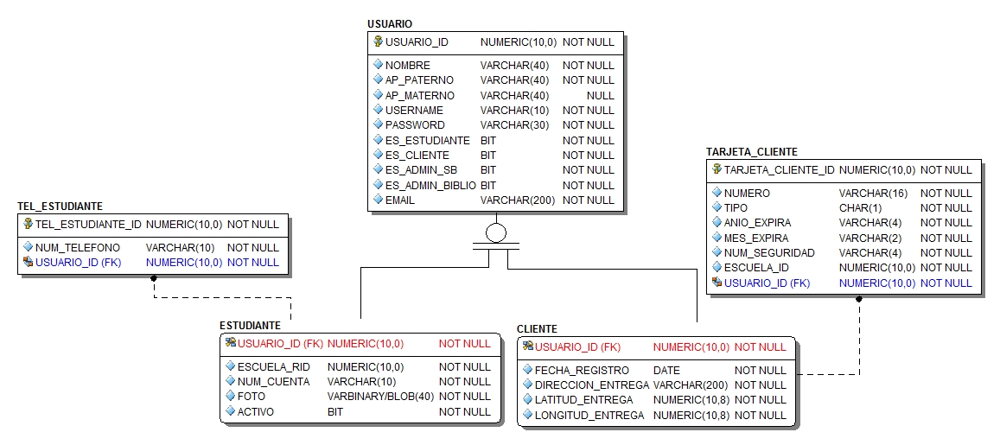

# SchoolBook
## schoolbook-usuarios.
* Este servicio se encarga de realizar la administración de los usuarios que acceden a las aplicaciones de SchoolBook:
	* Estudiantes
	* Clientes de sus librerías online
		* Administración de las tarjetas de crédito de los clientes.
	* Usuarios administradores de las aplicaciones.
* La definición del caso de estudio completo se puede revisar en este [enlace](https://github.com/school-book/schoolbook-app)
### Entidades principales
* Usuario
* Usuario - Cliente
* Usuario - Estudiante
* Tarjeta de Crédito de los clientes.
### Modelo relacional

* Observar que se ha propuesto una pequeña Jerarquía para separar los datos de los usuarios dependiendo su rol
* La entidad TARJETA_CREDITO aparece también en el servicio de contratos, sin embargo, esta entidad aplica únicamente para los clientes. La entidad del servicio de contrato corresponde a las tarjetas de crédito de las bibliotecas.
* Los N teléfonos de los estudiantes se guardan como atributos multivalorados. 
